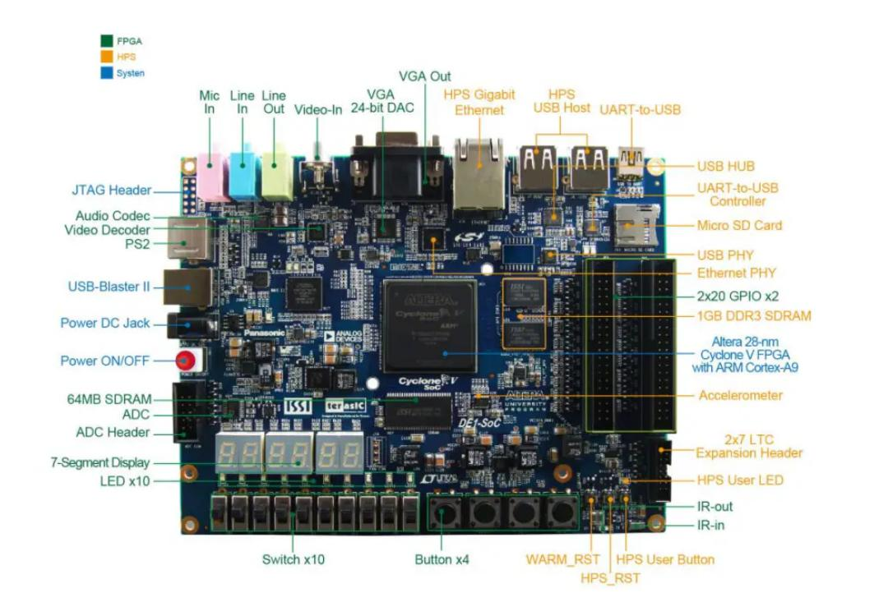
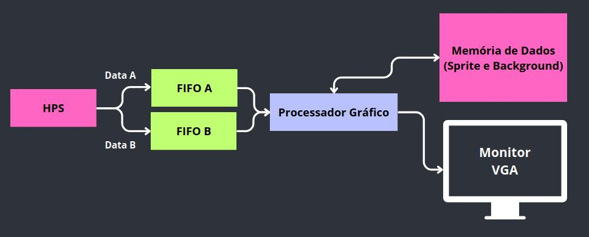

<h1 align="center"> GPU-HPS-Kernel Library </h1>

<h4 align="center">Projeto da disciplina TEC 499 - Módulo Integrador Sistemas Digitais.</h4>

Biblioteca para o processador gráfico projetado, destinada a ser usada com o HPS (Hard Processor System) na plataforma DE1-SoC.

## Sumário
- [Contextualização](#contextualizacao)
- [Recursos utilizados](recursos-utilizados)
    - [Hardware](hardware)
    - [Software e Ferramentas](software-e-ferramentas)
    - [Bibliotecas e Dependências](bibliotecas-e-dependencias)
- [Modelagem e Organização da Arquitetura](modelagem-e-organizacao-da-arquitetura)
    - [Arquitetura do Processador Gráfico](arquitetura-do-processador-grafico)
    - [Instruções do Processador Gráfico](instrucoes-do-processador-grafico)
    - [Protocolo de Comunicação entre o HPS e o Processador Gráfico](protocolo-de-comunicacao-entre-o-hps-e-o-processador-grafico)
- [Módulo Kernel]()
- [Desenvolvimento da Biblioteca](desenvolvimento-da-biblioteca)
    - [Comunicação entre a biblioteca e o módulo kernel](comunicacao-entre-a-biblioteca-e-o-modulo-kernel)
    - [Algoritmo para implementação das funções da GPU](Algoritmo-para-implementacao-das-funcoes-da-gpu)
    - [Fluxograma de Exibição da Imagem no Monitor](fluxograma-para-exibicao-da-imagem-no-monitor)
- [Configurações de ambiente e execução](#configuracoes-de-ambiente-e-execucao)
- [Referências](#referências)

## Contextualização

Este projeto foi desenvolvido para atender aos requisitos do _Problema 2 - Barramento_ do componente curricular TEC499 - Módulo Integrador de Sistemas Digitais. O objetivo principal é conceber um Módulo Kernel que possibilite a comunicação entre o processador de propósito geral da placa DE1-SoC e o processador gráfico embarcado na FPGA da mesma placa. Além disso, o projeto exige o desenvolvimento de uma biblioteca para facilitar o acesso geral aos recursos do sistema e o envio de instruções para a GPU, garantindo uma integração eficiente e acessível entre os componentes de hardware e software.

## Recursos Utilizados

### Hardware

#### Placa DE1-SoC

A DE1-SoC é uma plataforma de desenvolvimento poderosa que combina um processador ARM de propósito geral com uma FPGA (Field-Programmable Gate Array) da Intel. Esta combinação permite o desenvolvimento e teste de sistemas embarcados complexos que requerem tanto processamento flexível quanto funcionalidades de hardware personalizáveis. Segue abaixo uma lista com os principais componentes da placa:



* Processador ARM Cortex-A9:
    * Dual-core ARM Cortex-A9.
    * Integrado no SoC (System on Chip) Cyclone V da Intel.
    * Executa um sistema operacional como Linux, possibilitando o desenvolvimento de software de alto nível.

* FPGA Cyclone V:
    * FPGA de alto desempenho que pode ser programada para implementar diversas funcionalidades de hardware.
    * Permite a criação de controladores personalizados, interfaces de comunicação, processadores gráficos embarcados, e outros módulos de hardware especializados.

* Memória:
    * 1 GB de memória DDR3 SDRAM para o processador ARM.
    * 64 MB de memória SDRAM para a FPGA.
    * Memória flash de 2 GB (para armazenamento de sistemas operacionais, bootloaders, e outros arquivos).

* Interfaces de Entrada/Saída:
    * Ethernet 10/100/1000.
    * USB 2.0 (Host e Device).
    * HDMI (saída de vídeo).
    * VGA (saída de vídeo).
    * Áudio (entrada e saída).
    * GPIO (General Purpose Input/Output).
    * Conectores de expansão para adicionar módulos periféricos.

* Periféricos:
    * Conversores A/D e D/A.
    * Interface de cartão SD.
    * LEDs, botões, e switches para interações básicas.

#### Monitor CRT (Cathode Ray Tube)

Os monitores CRT (Cathode Ray Tube) foram a tecnologia predominante para telas de computador e televisores durante grande parte do século XX. Embora agora tenham sido amplamente substituídos por tecnologias mais modernas como LCD, LED, e OLED, os CRTs desempenharam um papel crucial no desenvolvimento da eletrônica de exibição e foram utilizados durante o desenvolvimento de todo o projeto para a realização de testes.

### Software e Ferramentas

#### Compilador: 

- **GNU Compiler Collection (GCC)**:
  - Compilador robusto e altamente compatível com padrões de linguagem;
  - Suporte a várias linguagens, incluindo C, C++, Fortran, e mais;
  - Otimizações de código para melhorar o desempenho do software.

#### Ferramentas de Desenvolvimento:

- **Visual Studio Code**:
  - Editor de código-fonte leve com suporte a extensões;
  - Integração com Git para controle de versão e GitHub para colaboração;
  - Ferramentas avançadas de depuração e personalização da interface.

- **Git e GitHub**:
  - Sistema de controle de versão distribuído para rastreamento de alterações no código;
  - GitHub como plataforma de hospedagem de repositórios Git na nuvem;
  - Facilita colaboração, revisão de código e integração contínua/desenvolvimento contínuo.

#### Linguagem de Programação: 

- **C**:
  - Linguagem de programação de propósito geral com foco em eficiência e controle;
  - Altamente portável e adequada para desenvolvimento de sistemas e aplicações de baixo nível;
  - Base para muitas outras linguagens e bibliotecas importantes;
  - Suporte extenso da comunidade e ampla aplicação em sistemas operacionais, drivers e aplicativos críticos.

### Dependências

1. Instalação de Bibliotecas e Ferramentas para Desenvolvimento em C, como o CMake, ferramenta de build para projetos C/C++;

    ```bash
    sudo apt-get install cmake
    ```

2. Instalação ou atualização do compilador _GCC_ para realizar a compilação dos arquivos do projeto. Utilize o primeiro comando para verificar a versão do compilador ou o segundo caso a instalação dele não tenha sido realizada ainda;

    ```bash
    gcc --version
    ```

    ```bash
    sudo apt-get install gcc
    ```

3. Instalação de pacotes essenciais para desenvolvimento e gerenciamento de módulos de kernel em sistemas operacionais baseados em Debian;

    ```bash
    sudo apt-get install build-essential kmod
    ```

4. Instalação e configuração do _git_ para facilitar a manipulação do projeto.

    ```bash
    sudo apt-get install git
    git config --global user.name "Seu Nome"
    git config --global user.email "seu.email@example.com"
    ```

## Modelagem e Organização da Arquitetura

A arquitetura consiste em um processador de propósito geral (HPS), duas FIFOs (First In First Out), uma PLL (Phase Locked Loop), e um Processador Gráfico. O HPS executa o código-fonte dos jogos em C, enquanto o Processador Gráfico gerencia a renderização, movendo e controlando sprites, modificando o background, e renderizando polígonos como quadrados e triângulos. As saídas principais do Processador Gráfico são os sinais de sincronização horizontal (h sync) e vertical (v sync) do monitor VGA, além dos bits de cores RGB.

Para comunicar o HPS e o Processador Gráfico, que operam em frequências diferentes, utilizam-se FIFOs intermediárias. A PLL gera os clocks necessários para o sistema. O HPS armazena nas FIFOs as instruções a serem executadas pelo Processador Gráfico. Um módulo Gerador de Pulso garante que as instruções sejam escritas nas FIFOs uma única vez.

Cada FIFO pode armazenar 16 palavras de 32 bits. O sinal wrfull indica quando a FIFO está cheia, ativando um circuito de proteção contra overflow. As FIFOs permitem a adição de novas instruções sem a necessidade de novos barramentos ou dispositivos intermediários entre o HPS e o Processador Gráfico.



### Instruções do Processador Gráfico

1. **Escrita no Banco de Registradores (WBR)**:
   Configura registradores que armazenam informações dos sprites e a cor base do background. O opcode é configurado em 0000 para definir as instruções, como mostrado nas figuras 8 e 9.

2. **Escrita na Memória de Sprites (WSM)**:
   Armazena ou modifica o conteúdo na Memória de Sprites. O opcode é configurado em 0001, e os campos R, G e B definem as novas cores RGB, conforme a figura 10.

3. **Escrita na Memória de Background (WBM)**:
   Modifica o conteúdo na Memória de Background, configurando valores RGB para áreas do background. O opcode é 0010, e a memória é dividida em blocos de 8x8 pixels, como mostrado na figura 11.

4. **Definição de um Polígono (DP)**:
   Define dados de polígonos na Memória de Instrução do Co-Processador. O opcode é 0011, e os campos incluem endereço, ponto de referência, tamanho, cor RGB, e forma (quadrado ou triângulo).

### Protocolo de Comunicação entre o HPS e o Processador Gráfico

Para enviar instruções ao Processador Gráfico, utiliza-se um protocolo simples com FIFOs e um Gerador de Pulso. As instruções em C acessam as GPIOs do sistema via Mapeamento de Memória. O controlador de barramento do HPS gerencia o acesso para escrita e leitura.

Instruções maiores que 32 bits utilizam dois barramentos de 32 bits (dataA e dataB). DataA é para opcodes e endereços, e dataB para dados. O sinal start, colocado em nível alto, ativa o Gerador de Pulso para escrever nas FIFOs. Após a escrita, start retorna a nível baixo para reiniciar o Gerador de Pulso, aguardando a próxima instrução.

Esse método evita redundâncias de instruções nas FIFOs, garantindo a escrita única e eficiente das instruções enviadas.


## Módulo de Kernel

O processador de propósito geral acessa a FPGA usando as pontes HPS-to-FPGA ou Lightweight HPS-to-FPGA. Essas pontes são mapeadas para regiões no espaço de memória do HPS. A fim de realizar a conexão do Processador Gráfico na FPGA com o Processador no HPS de forma mais facilitada, sem a necessidade de realizar o mapeamento de memória a cada acesso ao GPU, foi desenvolvido um módulo de kernel. Um módulo de kernel é um código que pode ser carregado e descarregado no kernel do sistema operacional Linux sem precisar recompilar ou reiniciar o sistema. Ele atua como uma extensão do kernel, adicionando novas funcionalidades ou suporte a novos dispositivos de hardware.

No Linux, existe uma grande diferença entre o espaço do Kernel e o espaço do usuário. O espaço do Kernel é uma área de memória reservada para a execução do núcleo do sistema operacional e seus módulos, onde o kernel tem controle total e pode acessar diretamente o hardware. Este espaço é privilegiado e seguro, prevenindo que aplicações de usuário possam interferir no funcionamento do sistema operacional. Por outro lado, o espaço do usuário é destinado à execução de aplicações e programas, sendo uma área menos privilegiada que não permite acesso direto ao hardware ou à memória do kernel, garantindo a estabilidade e segurança do sistema ao isolar as aplicações umas das outras e do núcleo do sistema.

Para conectar esses dois espaços, é possível gerar um arquivo (exclusivo para o hardware a ser acessado) que pode ser lido e/ou escrito, através de um driver de carácter, como mostrado no esquema da figura a seguir:


O objetivo principal do módulo de kernel desenvolvido é fornecer uma interface eficiente para escrita e leitura em dois barramentos, DATA A e DATA B, que conectam o processador HPS da placa DE1-SoC ao processador gráfico, facilitando a comunicação e melhorando o desempenho do sistema.

### Desenvolvimento do Módulo de Kernel

Para o devido funcionamento do módulo de kernel, alguns passos foram seguidos em seu desenvolvimento.

**1. Definição da Interface:**

Para iniciar foram definidas as bibliotecas a serem importadas para o funcionamento completo do código. Algumas bibilotecas da linguagem C não podem ser utilizadas em códigos do espaço do kernel, então nesses casos, foram substituídas por bibliotecas válidas, como a asm/uaccess.h para acesso a memória e linux/delay.h para a função de sleep. Após a importação das bibliotecas, foram realizadas as definições para os comandos de controle de E/S (ioctl) que serão utilizados para ler e escrever nos barramentos DATA_A e DATA_B. Cada barramento pode receber até 32 bits de dados, totalizando 64 bits para ambos os barramentos. Foram também definidos os locais de memória dos registradores WRREG e WRFULL, utilizados para dar start no envio de uma instrução e verificar se o buffer de instruções está cheio, respectivamente. 

**2. Estrutura do Módulo:**

O módulo de kernel foi estruturado em um arquivo principal (data_bus.c), contendo funções de inicialização, finalização, e operações de leitura e escrita. As principais funções do módulo incluem:

- Inicialização e Finalização: A funções (databus_init e databus_exit) são responsáveis por registrar e liberar o dispositivo de caractere associado ao driver.
- Operações de Controle de E/S (ioctl): As funçãos dev_ioctl lida com os comandos ioctl para leitura e escrita nos barramentos DATA_A e DATA_B.
- Operações de Controle do Arquivo: funções padrão do driver de caractere (read, write, open, release).

**3. Drive de Caracteres:**

O driver de caracter é uma parte fundamental do módulo de kernel quando se trata de comunicação com dispositivos de hardware. Ele fornece uma interface para leitura e escrita de dados entre o software e o hardware. No contexto do módulo de kernel desenvolvido, o driver de caracter desempenha um papel crucial.

- Estrutura e Funcionamento do Driver de Caracter:
    - Registro do Driver: O driver de caracter é registrado no sistema com uma identificação única (major number) que permite ao sistema operacional diferenciar entre diversos drivers de caracter.
    - Funções Principais: O driver deve implementar funções essenciais, como open, release, read e write.
        - Open: Função chamada quando um processo tenta abrir o dispositivo. Pode ser usada para inicializar variáveis ou recursos necessários.
        - Release: Função chamada quando um processo fecha o dispositivo. Usada para liberar recursos alocados.
        - Read: Função chamada para ler dados do dispositivo. Implementa a lógica de leitura de dados do hardware para o espaço de usuário.
        - Write: Função chamada para escrever dados no dispositivo. Implementa a lógica de escrita de dados do espaço de usuário para o hardware.
    - Interface com o Hardware: O driver de caracter comunica-se diretamente com o hardware, utilizando registradores de memória mapeados ou portas de E/S, para realizar operações de leitura e escrita.
    - Criação de Arquivo de Dispositivo: Um arquivo especial de dispositivo é criado no diretório /dev, que permite aos usuários e programas acessar o driver de caracter através de operações de arquivo padrão (open, read, write, close).

4. Implementação das Funções de Leitura e Escrita

- Função de Escrita: A instrução que será enviada para os barramentos Data A e Data B é recebida pelo módulo como uma instrução inteira de 64 bits. Logo, é necessário separá-la para escrever separadamente em cada barramento. Para realizar essa divisão, os primeiros 32 bits da instrução recebida são colocados na variável do Data A, e os outros 32 bits são deslocados para a variável do Data B. Isso é feito utilizando operações de máscara e deslocamento de bits, de forma que cada parte da instrução seja corretamente atribuída ao seu respectivo barramento. Exemplo do código a baixo:

  ```c
      data_a = (uint32_t)(data & 0xFFFFFFFF);
      data_b = (uint32_t)(data >> 32);
    ```
  
- Função de Leitura: A função de leitura tem como objetivo coletar os dados dos barramentos de saída do hardware e enviá-los para o espaço do usuário. Para isso, os dados são lidos de dois registradores diferentes e combinados em uma única instrução de 64 bits. Primeiramente, são lidos os 32 bits do primeiro registrador e armazenados na metade inferior da instrução. Em seguida, são lidos os 32 bits do segundo registrador e armazenados na metade superior da instrução. A instrução combinada é então copiada para o buffer de saída do usuário.  Exemplo do código a baixo:

  ```c
      data = ((uint64_t)data_b << 32) | data_a;

    ```
As funções copy_from_user e copy_to_user são funções do espaço do kernel utilizadas para realizar a escrita e leitura no hardware.

## Desenvolvimento da Biblioteca

#### Comunicação entre a biblioteca e o módulo kernel

Para estabelecer a comunicação entre a biblioteca e o módulo de Kernel, fazemos uso das instruções `write_data()`, `read_data` e `close_data`.

A função `write_data()`, como o nome pressupõe, efetua a escrita no arquivo utilizado para estabelecer a comunicação entre o modulo do kernel e os barramentos da GPU. As próximas instruções, `read_data()` e `close_data()`, reespectivamente, leem e encerram esse mesmo arquivo.


Em caso de erro, o programa é finalizado e uma mensagem de erro é emitida no terminal de execução. As assinaturas dessas instruções são dadas por: 

```C
/**
 * @brief Writes data to a hardware device.
 *
 * @param data The data to be written.
 */
void write_data(u64_t data);

/**
 * @brief Reads data from a hardware device.
 *
 * @return The read data.
 */
u64_t read_data();

/**
 * @brief Closes a data resource, such as a file.
 *
 */
void close_data();
```

#### Algoritmo para implementação das funções da GPU

O algoritmo para implementação das funções da GPU consiste basicamente na divisão dos dados selecionados pelo usuário entre os barramentos data A e data B. Para isso, desenvolvemos o seguinte algoritmo:


Para entendê-lo, vamos utilizar a função mais simples da GPU: a troca da cor do background. Se executarmos a função `set_background_color(2, 3, 3)`, inicialmente iremos fazer a inicialização das variáveis constantes (nesta caso em específico `opcode` e `reg`). Observe que as variáveis R, G e B são inicializadas com o valor estabelecido pelos parâmetros enviados através da função e `reg` e `opcode` são zerados. Além disso, `dataA` e `dataB` também encontram-se zerados por nenhum valor ter sido atribuído a eles.


No segundo passo, dividimos as informações entre dataA e dataB de acordo com o protocolo de comunicação HPS-FPGA, isto é, adicionamos aos barramentos as informações que devem ser enviadas às filas. No exemplo abaixo, deslocamos `reg` em 4 bits e `G` e `B`, respectivamente, em 3 e 6 bits, isso porque no barramento A a indicação do registrador vem antes do opcode e no barramento B a representação dos valores está na ordem B -> G -> R.


Nos passos 3 e 4, o que fazemos é inicializar e atribuir a um buffer de caractere os valores inteiros de dataA e dataB convertidos em string hexadecimal. Ou seja, os valores nessas duas variáveis é convertido para hexadecimal, completado com zeros e então concatenado no buffer declarado no passo 3.


No passo seguinte, convertemos a string para um valor inteiro na base desejada para que enfim possamos escrever essa isntrução no arquivo inicializado através da função `write_data()` e fechá-lo com `close_data()`, por fim, a função retorna a instrução como valor inteiro e finaliza a sua execução caso não haja nenhuma intercorrência durante a manipulação do arquivo.


### Fluxograma de Exibição da Imagem no Monitor

A exibição final da imagem no monitor, utilizando todos os elementos disponíveis pela GPU (polígonos, sprites, background e background blocks), foi realizada segundo o fluxograma a seguir. Pode-se dividir o envio de instruções para exibição da imagem em 5 partes. A primeira, como a definição do "céu" e da "grama", utilizando a cor azul no fundo e blocos verdes para a grama. A segunda parte, as "árvores" representadas pelas sprites. A terceira, a montagem da "base do castelo" utilizando os polígonos rosas. Já a quarta, com os "telhados" e "porta" do castelo, utilizando polígonos marrom. E, a última etapa, o "sol" amarelo, com um polígono, e as "nuvens" brancas com blocos de background. 

<div align="center">
   
</div>

## Configurações de Ambiente e Execução

Primeiramente, conecte a placa à energia e aos cabos de rede e VGA. Além disso, certifique-se de que a GPU, para a qual a biblioteca foi modelada, está embarcada na FPGA da placa DE1-SoC.

Para acessar o material desenvolvido, clone o repositório disponível na plataforma GitHub utilizando o seguinte comando no terminal Linux:

```bash
git clone https://github.com/yasmincsme/GraphicsProcessor-HPS-Kernel-Library.git
```

Após clonar o repositório com sucesso, conecte-se à placa via SSH. Para isso, é necessário conhecer o IP da placa. Por exemplo, se o IP for `10.0.0.124`, use o seguinte comando:

```bash
ssh aluno@10.0.0.124
```

Em seguida, transfira a pasta clonada do seu computador para o sistema de arquivos da placa:

```bash
mv GraphicsProcessor-HPS-Kernel-Library/[caminho do destino]
```

Para compilar e carregar o módulo do kernel desenvolvido, navegue até o diretório `src` do repositório e execute os seguintes comandos:

```bash
cd GraphicsProcessor-HPS-Kernel-Library/src/
make kernel load
```

O comando `make kernel` gerará os arquivos de compilação do módulo `gpp_data_bus.c`, e `load` o carregará no sistema como qualquer outro driver de dispositivo. Note que podem ocorrer problemas ao tentar carregar um módulo de kernel devido a permissões de dispositivo.

Se a operação for bem-sucedida, prossiga para compilar a biblioteca:

```bash
make build run
```

O comando `run` executará o arquivo gerado durante o processo de compilação.

---
